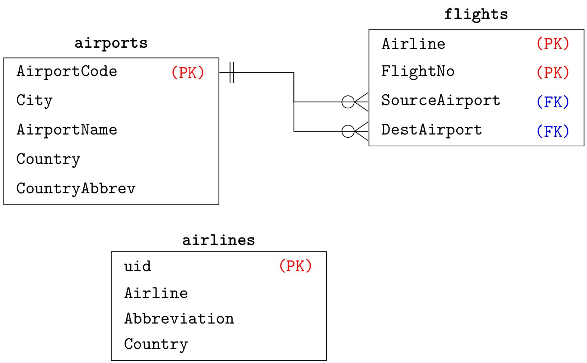

MPBoot CLI
================

General Help: `./ontop help bootstrap`

~~~
$ ./ontop help bootstrap
NAME
        ontop bootstrap - Bootstrap ontology and mapping from the database

SYNOPSIS
        ontop bootstrap [ {-a | --advanced} ] {-b | --base-iri} <base IRI>
                [ {-d | --definitions} <Bootstrapper Definitions File> ]
                [ --db-driver <DB driver> ] [ --db-password <DB password> ]
                [ --db-url <DB URL> ] {-m | --mapping} <mapping file>
                [ {-p | --properties} <properties file> ]
                {-t | --ontology} <ontology file>
                [ {-u | --db-user} <DB user> ]
                [ {-w | --workload} <Workload JSON file> ]

OPTIONS
        -a, --advanced
            Enable patterns-based generation (MPBoot)

        -b <base IRI>, --base-iri <base IRI>
            Base IRI of the generated mapping

        -d <Bootstrapper Definitions File>, --definitions <Bootstrapper Definitions File>
            Path to the bootstrapper configuration file

        --db-driver <DB driver>
            DB driver (overrides the properties)

        --db-password <DB password>
            DB password (overrides the properties)

        --db-url <DB URL>
            DB URL (overrides the properties)

        -m <mapping file>, --mapping <mapping file>
            Output mapping file in the Ontop native format (.obda)

        -p <properties file>, --properties <properties file>
            Properties file

        -t <ontology file>, --ontology <ontology file>
            Output OWL ontology file

        -u <DB user>, --db-user <DB user>
            DB user (overrides the properties)

        -w <Workload JSON file>, --workload <Workload JSON file>
            Query workload [with -a only]
~~~

Basic Generation (with `rdfs:domain` and `rdfs:range` declarations)
---

To invoke `MPBoot`, you use the `-a` option. In its basic usage, `MPBoot` enriches the generated ontology with
suitable `rdfs:domain` and `rdfs:range` declarations, for each of the produced data/object properties. 

```
./ontop bootstrap -a -p onto.properties -b 'http://baseuri.org' -m onto.obda -t onto.owl
```

The `onto.obda` and `onto.owl` file can be empty (mappings and ontology) files. The `-b` option specifies the *base uri* 
to be used for your ontology, and the `-a` option enables the _advanced mode_ (that is, `MPBoot` as opposed to the default ontop boostrapper).


MPBoot Configuration File (Dictionary)
--------

`MPBoot` accepts a`json` file for tuning the bootstrapping process according to users' needs. The most basic use of 
this configuration file is the specification of a `dictionary`. What is a dictionary useful for? 
In Direct Mapping, and therefore in the default ontop boostrapper, the names for classes and properties are based on 
table and attribute names used in the DB. A dictionary gives users the possibility to control the names used for the 
bootstrapping process, and to automatically declare common annotations:

```
{
  "dictionary" :
  [
    {
      "tableName" : "name",
      "tableAlias" : "alias",
      "tableLabels" : ["label1", "label2"],
      "tableSchema" : "schemaName",
      "attAliases" : [
        {
          "attName" : "name",
          "attAlias" : "alias1",
          "attLabels" : ["label1", "label2"]
        },
        {
          "attName" : "name",
          "attAlias" : "alias1",
          "attLabels" : ["label1", "label2"]
        }
      ],
      "references" : [
        {"fromAtts" : ["att1", "att2"], "toTable" : "table", "toAtts" : ["att1", "att2"], "joinAlias" : "alias", "joinLabels" : ["label1", "label2"] },
        {"fromAtts" : ["att1", "att2"], "toTable" : "table", "toAtts" : ["att1", "att2"], "joinAlias" : "alias" }
      ]
    },
    {
      "tableName" : "name",
      "tableAlias" : "alias",
      "tableLabels" : ["label1", "label2"],
      "tableComment" : "This is a comment for table 'name'",
      "tableSchema" : "schemaName",
      "attAliases" : [
        { "attName" : "name",
          "attAlias" : "alias1",
          "attLabels" : ["label1", "label2"],
          "attComment" : "This is a comment to attribute 'name'"
        },
        { "attName" : "name",
          "attAlias" : "alias1",
          "attLabels" : ["label1", "label2"]
        }
      ],
      "references" : [
        {"fromAtts" : ["att1", "att2"], "toTable" : "table", "toAtts" : ["att1", "att2"], "joinAlias" : "alias", "joinLabels" : ["label1", "label2"] },
        {"fromAtts" : ["att1", "att2"], "toTable" : "table", "toAtts" : ["att1", "att2"], "joinAlias" : "alias" }
      ]
    }
  ]
}
```

The dictionary specifies, for each table, aliases to be used in the ontology (the aliases can be specified for the 
table names, attribute names, and foreign key relationships). This comes useful whenever in the common situation where 
only a portion of the DB schema needs to be mapped, and not the rest.
Additionally, one can also specify `rdfs:label` annotations through the `attLabels` and `tableLables` keys. 
By the `attComment` and `tableComment` keys, `rdfs:comment` annotations can be produced.

**Note:** Whenever a dictionary is specified, the generation process will happen **only for the tables and attributes explicitly specified in the dictionary**. In case a dictionary is used in combination with the **SH** pattern (see below), then the generation will also involve tables and attributes not explicitly mentioned in the Dictionary but required by the SH pattern (in such a case, the same name convention of Direct Mapping will be applied over such tables and attributes).

### Example of `MPBoot` usage with dictionary:


Consider the following postgres DB:

```
CREATE TABLE public.a (
    id integer NOT NULL primary key
);


CREATE TABLE public.b (
    id integer NOT NULL primary key
);

ALTER TABLE ONLY public.a
    ADD CONSTRAINT a_1 FOREIGN KEY (id) REFERENCES public.b(id);

insert into b values (1);
insert into b values (2);
insert into a values (1);
```

Suppose we want to bootstrap ontology and mappings for the DB above, however we want to use different names than those specified in the DB. We can provide the following dictionary:

```
{
  "dictionary" : [
    {
      "tableName" : "a",
      "tableAlias" : "a_alias",
      "tableLabels" : ["a_lab1", "a_lab2"],
      "tableSchema" : "public",
      "attAliases" : [
        {
          "attName" : "id",
          "attAlias" : "id_alias",
          "attLabels" : ["id_lab1", "id_lab2"]
        }
      ],
      "references" : [
        {"fromAtts" : ["id"], "toTable" : "b", "toAtts" : ["id"], "joinAlias" : "join-alias", "joinLabels" : ["label1", "label2"] }
      ]
    },
    {
      "tableName" : "b",
      "tableAlias" : "b_alias",
      "tableLabels" : ["b_lab1", "b_lab2"],
      "tableSchema" : "public",
      "attAliases" : [
        {
          "attName" : "id",
          "attAlias" : "id_alias",
          "attLabels" : ["id_lab1", "id_lab2"]
        }
      ]
    }
  ]
}
```

To bootstrap the ontology and mappings, we run the following command:

```
./ontop bootstrap -a -p  onto/labels/labels.properties -b 'http://purl.org/labels/' -m onto/labels/labels.obda -t onto/labels/labels.owl
```

where the `labels.properties` file contains the connection parameters to our DB, for instance

```
#Tue Sep 29 10:47:21 CEST 2020
jdbc.url=jdbc\:postgresql\://$server\:$port/bootstrapper-labels
jdbc.driver=org.postgresql.Driver
jdbc.user=postgres
jdbc.name=c0a82a6a-9901-49bc-b336-d27487f5cdce
jdbc.password=postgres
```

the `labels.obda` and `labels.owl` are two empty files (which at the end of the bootstrapping process will contain our bootstrapped mappings and ontology, respectively).

The generated ontology and mappings will be as follows:

#### Generated Ontology

```
<?xml version="1.0"?>
<rdf:RDF xmlns="http://purl.org/labels/"
     xml:base="http://purl.org/labels/"
     xmlns:owl="http://www.w3.org/2002/07/owl#"
     xmlns:rdf="http://www.w3.org/1999/02/22-rdf-syntax-ns#"
     xmlns:xml="http://www.w3.org/XML/1998/namespace"
     xmlns:xsd="http://www.w3.org/2001/XMLSchema#"
     xmlns:rdfs="http://www.w3.org/2000/01/rdf-schema#">
    <owl:Ontology rdf:about="http://purl.org/labels/"/>
    


    <!-- 
    ///////////////////////////////////////////////////////////////////////////////////////
    //
    // Object Properties
    //
    ///////////////////////////////////////////////////////////////////////////////////////
     -->

    


    <!-- http://purl.org/labels/a_alias#join-alias -->

    <owl:ObjectProperty rdf:about="http://purl.org/labels/a_alias#join-alias">
        <rdfs:label rdf:datatype="http://www.w3.org/2001/XMLSchema#string">label1</rdfs:label>
        <rdfs:label rdf:datatype="http://www.w3.org/2001/XMLSchema#string">label2</rdfs:label>
    </owl:ObjectProperty>
    


    <!-- 
    ///////////////////////////////////////////////////////////////////////////////////////
    //
    // Data properties
    //
    ///////////////////////////////////////////////////////////////////////////////////////
     -->

    


    <!-- http://purl.org/labels/a_alias#id_alias -->

    <owl:DatatypeProperty rdf:about="http://purl.org/labels/a_alias#id_alias">
        <rdfs:domain rdf:resource="http://purl.org/labels/a_alias"/>
        <rdfs:range rdf:resource="http://www.w3.org/2001/XMLSchema#integer"/>
        <rdfs:label rdf:datatype="http://www.w3.org/2001/XMLSchema#string">id_lab1</rdfs:label>
        <rdfs:label rdf:datatype="http://www.w3.org/2001/XMLSchema#string">id_lab2</rdfs:label>
    </owl:DatatypeProperty>
    


    <!-- http://purl.org/labels/b_alias#id_alias -->

    <owl:DatatypeProperty rdf:about="http://purl.org/labels/b_alias#id_alias">
        <rdfs:domain rdf:resource="http://purl.org/labels/b_alias"/>
        <rdfs:range rdf:resource="http://www.w3.org/2001/XMLSchema#integer"/>
        <rdfs:label rdf:datatype="http://www.w3.org/2001/XMLSchema#string">id_lab1</rdfs:label>
        <rdfs:label rdf:datatype="http://www.w3.org/2001/XMLSchema#string">id_lab2</rdfs:label>
    </owl:DatatypeProperty>
    


    <!-- 
    ///////////////////////////////////////////////////////////////////////////////////////
    //
    // Classes
    //
    ///////////////////////////////////////////////////////////////////////////////////////
     -->

    


    <!-- http://purl.org/labels/a_alias -->

    <owl:Class rdf:about="http://purl.org/labels/a_alias">
        <rdfs:label rdf:datatype="http://www.w3.org/2001/XMLSchema#string">a_lab1</rdfs:label>
        <rdfs:label rdf:datatype="http://www.w3.org/2001/XMLSchema#string">a_lab2</rdfs:label>
    </owl:Class>
    


    <!-- http://purl.org/labels/b_alias -->

    <owl:Class rdf:about="http://purl.org/labels/b_alias">
        <rdfs:label rdf:datatype="http://www.w3.org/2001/XMLSchema#string">b_lab1</rdfs:label>
        <rdfs:label rdf:datatype="http://www.w3.org/2001/XMLSchema#string">b_lab2</rdfs:label>
    </owl:Class>
</rdf:RDF>


<!-- Generated by the OWL API (version 4.5.9) https://github.com/owlcs/owlapi -->


```

#### Generated Mappings

```
[PrefixDeclaration]
obda:		https://w3id.org/obda/vocabulary#
xsd:		http://www.w3.org/2001/XMLSchema#
owl:		http://www.w3.org/2002/07/owl#
rdf:		http://www.w3.org/1999/02/22-rdf-syntax-ns#
rdfs:		http://www.w3.org/2000/01/rdf-schema#

[MappingDeclaration] @collection [[
mappingId	BOOTSTRAPPED-MAPPING-ID1
target		<http://purl.org/labels/a_alias/id_alias={id}> a <http://purl.org/labels/a_alias> ; <http://purl.org/labels/a_alias#id_alias> {id}^^xsd:integer . 
source		SELECT * FROM "a"

mappingId	BOOTSTRAPPED-MAPPING-ID2
target		<http://purl.org/labels/a_alias/id_alias={a_id}> <http://purl.org/labels/a_alias#join-alias> <http://purl.org/labels/b_alias/id_alias={b_id}> . 
source		SELECT "a"."id" AS a_id, "b"."id" AS b_id FROM "a", "b" WHERE "a"."id" = "b"."id"

mappingId	BOOTSTRAPPED-MAPPING-ID3
target		<http://purl.org/labels/b_alias/id_alias={id}> a <http://purl.org/labels/b_alias> ; <http://purl.org/labels/b_alias#id_alias> {id}^^xsd:integer . 
source		SELECT * FROM "b"
]]

```

### Materialization

Let's try to materialize the triples corresponding to the generated ontology and mappings above,
through the `ontop materialize` command:

```
./ontop materialize -f turtle -p onto/labels/labels.properties -m onto/labels/labels.obda -t onto/labels/labels.owl -o labels.ttl
```

Then, the result will be the following set of RDF triples:

```
<http://purl.org/labels/a_alias/id_alias=1> <http://purl.org/labels/a_alias#join-alias> <http://purl.org/labels/b_alias/id_alias=1> .
<http://purl.org/labels/b_alias/id_alias=1> a <http://purl.org/labels/b_alias> .
<http://purl.org/labels/b_alias/id_alias=2> a <http://purl.org/labels/b_alias> .
<http://purl.org/labels/a_alias/id_alias=1> a <http://purl.org/labels/b_alias> .
<http://purl.org/labels/b_alias/id_alias=1> <http://purl.org/labels/b_alias#id_alias> "1"^^<http://www.w3.org/2001/XMLSchema#integer> .
<http://purl.org/labels/b_alias/id_alias=2> <http://purl.org/labels/b_alias#id_alias> "2"^^<http://www.w3.org/2001/XMLSchema#integer> .
<http://purl.org/labels/a_alias/id_alias=1> a <http://purl.org/labels/a_alias> .
<http://purl.org/labels/b_alias> <http://www.w3.org/2000/01/rdf-schema#label> "b_lab2" .
<http://purl.org/labels/a_alias#join-alias> <http://www.w3.org/2000/01/rdf-schema#label> "label1" .
<http://purl.org/labels/a_alias> <http://www.w3.org/2000/01/rdf-schema#label> "a_lab1" .
<http://purl.org/labels/a_alias#join-alias> <http://www.w3.org/2000/01/rdf-schema#label> "label2" .
<http://purl.org/labels/a_alias> <http://www.w3.org/2000/01/rdf-schema#label> "a_lab2" .
<http://purl.org/labels/a_alias#id_alias> <http://www.w3.org/2000/01/rdf-schema#label> "id_lab2","id_lab1" .
<http://purl.org/labels/b_alias#id_alias> <http://www.w3.org/2000/01/rdf-schema#label> "id_lab1" .
<http://purl.org/labels/b_alias> <http://www.w3.org/2000/01/rdf-schema#label> "b_lab1" .
<http://purl.org/labels/b_alias#id_alias> <http://www.w3.org/2000/01/rdf-schema#label> "id_lab2" .
<http://purl.org/labels/a_alias/id_alias=1> <http://purl.org/labels/a_alias#id_alias> "1"^^<http://www.w3.org/2001/XMLSchema#integer> .
```

Mapping Patterns
---

The name `MPBoot` comes from the _mapping patterns_ approach described in 
[this work](https://arxiv.org/abs/2012.01917)]. Currently, `partial` support is provided for advanced patterns 
concerning class hierarchies and clustering columns.

Class Hierarchies (Mapping Pattern "SH")
---

`MPBoot` provides a limited support to the _mapping patterns_ described in 
[this work](https://arxiv.org/abs/2012.01917)], in order to produce richer KGs that better reflect the actual 
conceptual model underlying the source database. One of the patterns partially supported by `MPBoot` is the 
"Schema Hierachy" (SH) pattern, which is used for the automatic discovery of class hierarchies. Pattern SH can be 
enabled through the following option in the configuration file:

~~~
{
   "enableSH" : true
}
~~~

If such an option is enabled, then whenever a foreign key is of the kind _"primary key -> primary key"_ is encountered, 
then the referring table will be rendered in the KG as a subclass of the referred table.

Clusters (Patterns CE2C, CE2D and CE2O)
---

~~~
{
  "clusters" : [
    {
      "type" : "class",
      "tableSchema" : "public",
      "tableName": "a",
      "clusteringAttribute" : "ca",
      "clusteringMap" : [
        {"key" : "key", "value" : "value"},
        {"key" : "key", "value" : "value"}
      ]
    },
    {
      "type" : "obj-prop",
      "tableSchema" : "public",
      "tableName": "b",
      "clusteringAttribute" : "ca"
    },
    {
      "type" : "data-prop",
      "tableSchema" : "public",
      "tableName": "c",
      "clusteringAttribute" : "ca"
    }
  ],
  "auto-clusters" : 0.001
}
~~~

Task-driven Generation
---

### Rationale

If a SQL query workload is available, `MPBoot` can exploit it in order to extract undeclared foreign key between tables, 
and therefore hidden object properties relating classes.

Assume the following database schema `spider-flights`: 



Intuitively, there should be a foreign-key relationship from the `Airline` attribute in `flights` to the `uid`
attribute in `airlines`. However, for unspecified reasons, this relationship is not declared in the `spider-flights` DB.
This is a very common situation, and Direct Mapping fall short in dealing with under-specified schemas.

If a workload of SQL queries is available, `MPBoot` can exploit it in order to discover these _hidden_ foreign-keys.

For our `spider-flights` DB, a user wrote the following query:

~~~ 
SELECT count(*) 
FROM FLIGHTS AS T1 JOIN AIRLINES AS T2 
ON T1.\"Airline\"  =  T2.uid WHERE T2.\"Airline\" = 'JetBlue Airways'
~~~

Such query states a join between `flights.Airline` and `airlines.uid`. Out of this join, and a containment check over 
the database instance, MPBoot is able to infer the following mapping:

~~~
mappingId	BOOTSTRAPPED-MAPPING-ID6
target		:spider-flights/flights/Airline={flights_Airline};FlightNo={flights_FlightNo} 
               :spider-flights#join-Airline :spider-flights/airlines/uid={airlines_uid} . 
source		SELECT "flights"."Airline" AS "flights_Airline", 
                   "flights"."FlightNo" AS "flights_FlightNo",
                   "airlines"."uid" AS "airlines_uid" 
           FROM "flights", "airlines" WHERE flights."Airline" = airlines.uid
~~~

capturing the relationship between flights and airlines.

## Usage

Workloads are passed to `MPBoot` through json files. Such files are structured as in the following example:

~~~
{
    {
        "query": "SELECT count(*) FROM FLIGHTS AS T1 JOIN AIRPORTS AS T2 ON T1.\"SourceAirport\"  =  T2.\"AirportCode\" WHERE T2.\"City\"  =  'Aberdeen'"
    },
    {
        "query": "SELECT count(*) FROM FLIGHTS AS T1 JOIN AIRPORTS AS T2 ON T1.\"SourceAirport\"  =  T2.\"AirportCode\" WHERE T2.\"City\"  =  'Aberdeen'"
    },
    {
        "query": "SELECT count(*) FROM FLIGHTS AS T1 JOIN AIRPORTS AS T2 ON T1.\"DestAirport\"  =  T2.\"AirportCode\" WHERE T2.\"City\"  =  'Aberdeen'"
    },
    {
        "query": "SELECT count(*) FROM FLIGHTS AS T1 JOIN AIRPORTS AS T2 ON T1.\"DestAirport\"  =  T2.\"AirportCode\" WHERE T2.\"City\"  =  'Aberdeen'"
    },
    ...
}
~~~

Assume the content above to be stored in a file `spider_flights_queries.json`. Then, we can invoke `MPBoot` with the 
workload option `-w` as in the following example:

~~~
./ontop bootstrap -a \
                  -b "http://www.example.org/" \
                  -p "spider_flights.properties" \
                  -m "spider_flights.obda" \
                  -t "spider_flights.owl" \
                  -w "spider_flights_queries.json"
~~~